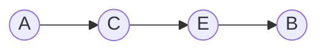
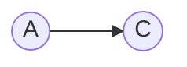
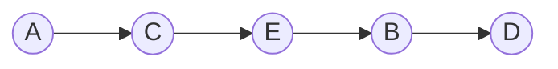
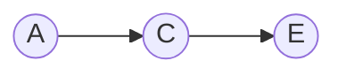
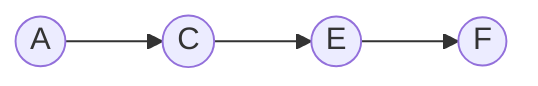
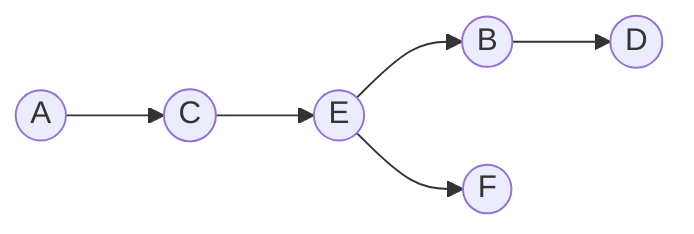

# Exemplo

## Grafo

|           |    A |    B |    C |    D |    E |    F |
|:----------|-----:|-----:|-----:|-----:|-----:|-----:|
| A         |    0 |   12 |    4 | 1000 | 1000 | 1000 |
| B         | 1000 |    0 |    6 |    6 | 1000 | 1000 |
| C         | 1000 |   10 |    0 | 1000 |    2 | 1000 |
| D         | 1000 | 1000 |    8 |    0 | 1000 |    6 |
| E         | 1000 |    2 | 1000 | 1000 |    0 |    6 |
| F         | 1000 | 1000 | 1000 | 1000 | 1000 |    0 |

## Inicializando Tabela

|           | A* |    B |    C |    D |    E |    F |
|:----------|---:|-----:|-----:|-----:|-----:|-----:|
| Distância |  0 | 1000 | 1000 | 1000 | 1000 | 1000 |
| Anterior  |  - |    - |    - |    - |    - |    - |

## Saindo de A

Analisamos os vizinhos de `A` e atualizamos a tabela quando a nova distância for menor que a distância registrada anteriormente.

Pode-se ir para:

1. `B` com distância `0 + 12 = 12`;
2. `C` com distância `0 + 4 = 4`.

|           | A* |  B |  C |    D |    E |    F |
|:----------|---:|---:|---:|-----:|-----:|-----:|
| Distância |  0 | 12 |  4 | 1000 | 1000 | 1000 |
| Anterior  |  - |  A |  A |    - |    - |    - |

Como `4 < 12`, escolhemos `C` como o próximo ponto de partida.

Como a menor distância de `A` até `C` já foi encontrada, `C` será fechado.

|           | A* |  B | C* |    D |    E |    F |
|:----------|---:|---:|---:|-----:|-----:|-----:|
| Distância |  0 | 12 |  4 | 1000 | 1000 | 1000 |
| Anterior  |  - |  A |  A |    - |    - |    - |

## Saindo de C

Pode-se ir para:

1. `B` com distância `4 + 10 = 14`;
2. `E` com distância `4 + 2 = 6`.

Como `B` já possui distância `12`, e `12 < 14`, a distância de `B` não será alterada.

Como `E` ainda estava com distância `1000`, atualizamos sua distância para `6` e marcamos `C` como anterior.

|           | A* |  B | C* |    D |  E |    F |
|:----------|---:|---:|---:|-----:|---:|-----:|
| Distância |  0 | 12 |  4 | 1000 |  6 | 1000 |
| Anterior  |  - |  A |  A |    - |  C |    - |

Entre os vértices ainda abertos, `E` possui a menor distância. Portanto, `E` será fechado.

|           | A* |  B | C* |    D | E* |    F |
|:----------|---:|---:|---:|-----:|---:|-----:|
| Distância |  0 | 12 |  4 | 1000 |  6 | 1000 |
| Anterior  |  - |  A |  A |    - |  C |    - |

## Saindo de E

Pode-se ir para:

1. `B` com distância `6 + 2 = 8`;
2. `F` com distância `6 + 6 = 12`.

Como `8 < 12`, a distância de `B` será atualizada para `8`, e seu anterior passa a ser `E`.

Como `12 < 1000`, a distância de `F` será atualizada para `12`, e seu anterior passa a ser `E`.

|           | A* |  B | C* |    D | E* |  F |
|:----------|---:|---:|---:|-----:|---:|---:|
| Distância |  0 |  8 |  4 | 1000 |  6 | 12 |
| Anterior  |  - |  E |  A |    - |  C |  E |

Entre os vértices ainda abertos, `B` possui a menor distância. Portanto, `B` será fechado.

|           | A* | B* | C* |    D | E* |  F |
|:----------|---:|---:|---:|-----:|---:|---:|
| Distância |  0 |  8 |  4 | 1000 |  6 | 12 |
| Anterior  |  - |  E |  A |    - |  C |  E |

## Saindo de B

Pode-se ir para:

1. `C`, mas `C` já foi visitado;
2. `D` com distância `8 + 6 = 14`.

Como `14 < 1000`, atualizamos a distância de `D` para `14`, e seu anterior passa a ser `B`.

|           | A* | B* | C* |  D | E* |  F |
|:----------|---:|---:|---:|---:|---:|---:|
| Distância |  0 |  8 |  4 | 14 |  6 | 12 |
| Anterior  |  - |  E |  A |  B |  C |  E |

Agora, entre os vértices ainda abertos, temos:

1. `F` com distância `12`;
2. `D` com distância `14`.

Como `12 < 14`, o próximo vértice fechado será `F`.

|           | A* | B* | C* |  D | E* | F* |
|:----------|---:|---:|---:|---:|---:|---:|
| Distância |  0 |  8 |  4 | 14 |  6 | 12 |
| Anterior  |  - |  E |  A |  B |  C |  E |

## Saindo de F

Não podemos ir para lugar algum.

A tabela não precisa de modificações.

O único vértice ainda aberto é `D`, então `D` será fechado.

|           | A* | B* | C* | D* | E* | F* |
|:----------|---:|---:|---:|---:|---:|---:|
| Distância |  0 |  8 |  4 | 14 |  6 | 12 |
| Anterior  |  - |  E |  A |  B |  C |  E |

## Saindo de D

Pode-se ir para:

1. `C`, mas `C` já foi visitado;
2. `F`, mas `F` já foi visitado.

A tabela não precisa de modificações.

### Fim do Loop

Sendo assim, conseguimos a seguinte tabela, com todos os vértices fechados:

|           | A* | B* | C* | D* | E* | F* |
|:----------|---:|---:|---:|---:|---:|---:|
| Distância |  0 |  8 |  4 | 14 |  6 | 12 |
| Anterior  |  - |  E |  A |  B |  C |  E |

Com ela, é possível identificar os menores caminhos para qualquer vértice a partir de `A`.

Para isso, é preciso fazer uma leitura reversa dos elementos da linha `Anterior`, começando pelo destino e voltando até a origem.

1. **A → B:** `B ← E ← C ← A`
2. **A → C:** `C ← A`
3. **A → D:** `D ← B ← E ← C ← A`
4. **A → E:** `E ← C ← A`
5. **A → F:** `F ← E ← C ← A`

Sendo assim, temos as seguintes rotas:

## Rota de A até B

## Rota de A até C

## Rota de A até D

## Rota de A até E

## Rota de A até F

## Todas as rotas em um único diagrama

